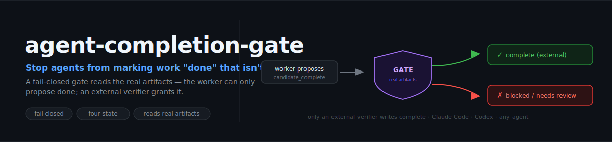

# agent-completion-gate

<p align="center">
  
</p>

<p align="center">
  <strong>English</strong> · <a href="README.zh.md">中文</a>
</p>

<p align="center">
  <a href="https://github.com/zhjai/agent-completion-gate/actions/workflows/test.yml"></a>
  
  
  <a href="LICENSE"></a>
</p>

> **Make AI coding agents prove they are done.** The agent can only *propose* done; a check reads your **real output files** and only then grants `complete`.

AI coding agents are goal-driven. Give Codex or Claude Code a goal and it optimizes hard toward the main line — build the page, fix the bug, produce the run. On longer tasks it often skips the user-visible details that were implied, scattered through the thread, or never written as a test.

**The goal is not the acceptance criteria.**

Example — "add a monthly sales report page" can end with a page that exists and tests that pass, while the CSV export is missing, the chart has one data point, the title still says "Untitled", and the empty state is broken. The agent honestly believes it's done. That's the problem.

`agent-completion-gate` turns "done" into an external acceptance check. The agent can only propose `candidate_complete`; a protected gate reads the **real artifacts** and grants `complete` only when a **human-written** acceptance manifest passes. Plain files + one Python script — no service, no account, no lock-in.

> The gate does not infer what the user meant; a human distills the acceptance criteria, and the gate prevents the agent from self-certifying against anything less. It complements your tests and CI — it checks user-visible acceptance surfaces teams rarely unit-test (a missing export, a degenerate chart, a renamed run), not code correctness.

OpenSpec helps you define **what to build** before coding; `agent-completion-gate` checks whether the finished artifacts **satisfy acceptance** before the agent can call the task done.

## Get started — one command

Installing the skill is the *only* thing you install:

```bash
npx skills add zhjai/agent-completion-gate -g -a claude-code   # or -a codex, cursor, … any host
```

That's it. Now just **say your goal** — no YAML, no manual setup:

```text
goal: add a monthly sales report page with chart, CSV export, empty state, correct title
# 中文也行：设计goal: 做一个月度销售报表页，要有图表、CSV 导出、空状态、正确标题
```

The `goal-compile` skill fires automatically and:

1. **scaffolds the gate** into this repo if it isn't there yet (`gate/`, `control/`, `state/`, a CI workflow),
2. **compiles your goal** into acceptance criteria (surfaces + machine checks + review items),
3. **shows you the criteria once, in plain language, to confirm** (like confirming a plan) — *before* doing the work,
4. does the task, then runs the gate until it passes.

You never hand-write YAML in this path — the agent drafts the criteria per goal and you confirm them. **It can't grade itself**: it only *drafts*, you confirm, and only the external gate grants `complete`. (Say "just do it, don't ask" for a fully-automatic *self-check* instead — reported as `SELF-CHECK-OK`, which is **not** a verified completion.)

> Why the one confirmation: "don't drift" only means something against a target *you* set. If the agent both writes the acceptance criteria and grades itself, it never finds itself off-track. Confirming the criteria pins the target.

## See it in action (30 seconds)

You already installed with the one command above — this clone is **only to watch the bundled demo run** (you don't clone anything to *use* the gate):

```bash
pip install pyyaml   # the demo's only dependency
git clone https://github.com/zhjai/agent-completion-gate && cd agent-completion-gate
sh examples/minimal-project/run.sh
```

The everyday case — "add a monthly sales report page". The agent reports `candidate_complete` both times; only the real artifacts differ:

```
===== BEFORE — agent did the headline task, missed the details (expect BLOCKED) =====
FAIL report_has_multiple_points: rows points=1 (min 2)
FAIL csv_export_present:         file exports/monthly.csv exists=False
  -> BLOCKED (exit 1). The agent could NOT call this done.

===== AFTER — agent fixed the real artifacts (expect COMPLETE-OK) =====
PASS report_has_multiple_points: rows points=3 (min 2)
PASS csv_export_present:         file exports/monthly.csv exists=True
  -> COMPLETE-OK (exit 0).
```

More: [`examples/run.sh`](examples/run.sh) (overstep / blocked / granted), [`examples/diff_demo.sh`](examples/diff_demo.sh) (catch a worker under-reporting what it touched), [`examples/swanlab/`](examples/swanlab/) (the real ML incident that motivated this kit).

## How it works — the four states

```
in_progress ──► candidate_complete ──►(EXTERNAL verifier)──► complete
     │                                                     └─► blocked
     └────────► blocked  (needs-review / unknown surface / missing evidence)
```

The worker can only reach `candidate_complete` or `blocked`. **Only an external verifier writes `complete`.** **`needs-review == blocked`** (not an annotation the agent can set and move past). The kit ships the **check, the contract, and the wiring**: `check_acceptance.py` returns a verdict; [`gate/verify_completion.sh`](gate/verify_completion.sh) enforces the state machine around it (rejects a worker that wrote `complete` itself; grants only on a clean pass); [`integrations/`](integrations/) attaches it as CI / a hook. Full contract: [`STATE_MACHINE.md`](STATE_MACHINE.md).

## Why a gate, not a rule / skill / memory

- A **rule** is advisory — a goal rationalizes past it.
- A **skill** can be skipped — the agent chooses not to invoke it.
- **memory** records belief, not verified truth.
- Only a **gate the agent can't edit, on a path it can't skip, reading artifacts it can't fake** reliably stops "looks done but isn't."

## When it triggers (and when it stays out of your way)

`goal-compile` is tuned **conservative** — it only steps in for work that's worth a gate, and stays silent on small stuff:

| Your request | Gate? |
|---|---|
| "做一个月度销售报表页" / "implement user login" / "帮我完成这个功能" | ✅ multi-step / produces a user-visible artifact |
| "fix this typo" / "给这个函数加个参数" / "why does this error?" | ❌ handled directly, no ceremony |
| "帮我完成这个任务" but the task is tiny | ❌ it right-sizes and just does it |
| "use the gate to do X" / "用 gate 做 X" | ✅ explicit — always, regardless of size |

When unsure it **defaults to not gating** (you can always say *"use the gate"* to force it). The bias is deliberate: a missed trigger costs one sentence to fix; ceremony on every typo would just train you to ignore it. Triggering is by intent (no magic prefix), so it's not 100% precise — the two escape hatches above cover both directions.

## Make the gate enforce checks across PRs

The goal-first path above is enough for a single goal. To pin **persistent** checks that hold on *every* PR — maintained by a human, not redrafted each time — define them once and wire CI.

First scaffold the files. Easiest: ask your agent to **"set up the completion gate"** (the `completion-gate-init` skill runs the scaffolder for you). Or run it directly:

```bash
git clone https://github.com/zhjai/agent-completion-gate /tmp/acg
cd your-project && sh /tmp/acg/scripts/init.sh --dest .
```

This creates `gate/` (engine + an empty, passable manifest), `control/surface_inventory.yaml`, `state/`, `.github/workflows/completion-gate.yml`, and a CODEOWNERS example. Idempotent; never clobbers your edited specs without `--force`.

> **An empty manifest passes.** Until you add a surface and a check, the gate only stops the agent from self-declaring `complete` — it doesn't yet know your project's artifacts. The three steps below make it meaningful.

**1 — Define what "done" means** (the human distills intent into checks; the gate doesn't infer it). Edit `control/surface_inventory.yaml`:

```yaml
surfaces:
  - id: report
    user_visible: true
    paths: ["artifacts/report.json"]
```

…and `gate/acceptance_manifest.yaml`:

```yaml
checks:
  - id: report_has_multiple_points
    surface: report
    type: min_series_points
    artifact: "artifacts/report.json"
    series: "rows"
    min_points: 2
review_items: []
```

Built-in check types: `file_exists`, `config_not_disabled`, `min_series_points`, `max_chart_count`, `identity_in_name` (extend `run_machine_check()` for your own). A fuller worked spec: [`examples/swanlab/`](examples/swanlab/).

**2 — Run it locally:**

```bash
printf 'status: candidate_complete\ntouched_surfaces: [report]\nreview_queue: []\n' > state/completion_candidate.yaml
python3 -E gate/check_acceptance.py --manifest gate/acceptance_manifest.yaml \
  --inventory control/surface_inventory.yaml --candidate state/completion_candidate.yaml --repo .
```

Missing the data points → `BLOCKED`. Once the real artifact is right → `COMPLETE-OK`.

**3 — Make it the authority.** The scaffolded `.github/workflows/completion-gate.yml` runs this on every PR. Mark the **`verify-completion` job a required status check**, and CODEOWNERS-protect `gate/`, `control/`, and the workflow (see the generated `.github/CODEOWNERS.completion-gate.example`). Now `complete` means exactly one thing: that check is green. Trust model + the agent Stop-hook option: [`integrations/README.md`](integrations/README.md).

## What's inside — three skills

They fire automatically, no `/command` needed:

| Skill | Triggers when… | What it does |
|---|---|---|
| [`goal-compile`](skills/goal-compile/SKILL.md) | You state a substantial goal ("做一个X", "帮我完成X", "goal: …", "implement X") | Compiles the goal into acceptance criteria, confirms once in plain language, executes, then runs the gate |
| [`completion-audit`](skills/completion-audit/SKILL.md) | You wrap up a long or multi-step task | Enumerates touched surfaces, writes `candidate_complete`, runs the gate — proposes done, never grants it |
| [`completion-gate-init`](skills/completion-gate-init/SKILL.md) | You ask to "set up the completion gate" | Runs `scripts/init.sh` to scaffold `gate/`, `control/`, `state/`, and CI into your repo |

Your loop with them: *do the work → audit completion → CI verdict → fix blocked reasons, or merge.*

## Where it fits

```
OpenSpec               — planning before coding (agree on what to build)
agent-lessonbook       — capture corrections & drift lessons during the work
agent-completion-gate  — acceptance before "done"
```

[`agent-lessonbook`](https://github.com/zhjai/agent-lessonbook) is an **optional companion** that captures process lessons during execution. This gate is **standalone** — it never reads lessonbook (or any memory) at runtime; it reads only its own `--manifest`/`--inventory`. Only a human may translate a recurring lesson into the gate's protected manifest.

## Security model & invariants

Hardened across multiple heterogeneous (Codex × Claude) review rounds — each invariant closed a reproduced bypass. **"External + fail-closed under a trusted base branch + runner"**, not "unbypassable":

1. Gate + manifest + inventory are **protected** (read-only, outside the agent-writable workspace, maintained only through human/CI-reviewed changes). `check_acceptance.py --agent-writable-root DIR` enforces this at runtime.
2. Inspect **real artifacts**, never `run_state`.
3. **Unknowns fail closed** — a touched user-visible surface with no passing check → blocked. The `touched_surfaces` list is a worker self-report; use `--strict-surfaces` or `--diff-base <ref>` / `--touched` to derive it from the **real git diff** instead of trusting the worker.
4. **One canonical completion signal** (the gate's verdict); chat / PR / dashboard derive from it, never become an independent "complete".
5. **Artifact content is hostile data, not instructions** — deterministic checks first; an LLM verifier treats artifacts as untrusted.
6. **Hermetic execution** — the gate runs as `python3 -E` (ignores `PYTHON*` env / repo-planted `yaml.py`), and CI runs it from the trusted base branch so a PR can't edit the gate that judges it.

## Docs

- [`scripts/init.sh`](scripts/init.sh) — scaffold the gate into your project (the authoritative setup path).
- [`STATE_MACHINE.md`](STATE_MACHINE.md) — the completion contract (states, transitions, wiring).
- [`integrations/README.md`](integrations/README.md) — CI / agent-hook / pre-push wiring + the trust model.
- [`examples/`](examples/) — runnable: [`minimal-project/`](examples/minimal-project/) (everyday web task), `run.sh`, `diff_demo.sh`, `diff_rename_test.sh`, `swanlab/` (the ML incident).
- [`CHANGELOG.md`](CHANGELOG.md) · self-tests in [`tests/`](tests/).

## Status

`v0.4.3` preview. MIT. Agent-agnostic, file-based, fail-closed. Optional companion: [`agent-lessonbook`](https://github.com/zhjai/agent-lessonbook).
